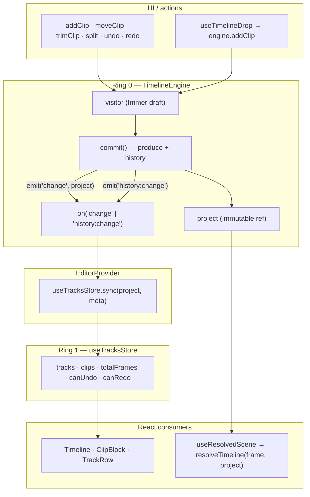
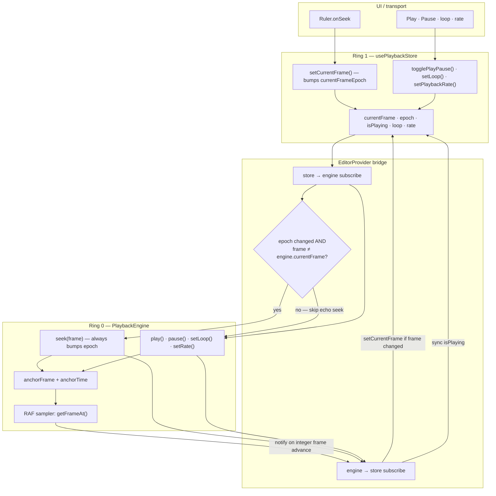
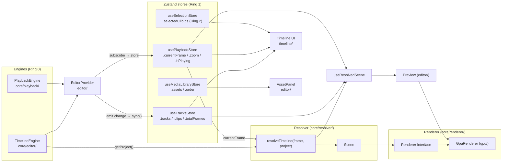

# Architecture

> The design principles, layer boundaries, and data flow of the editor engine. This is the canonical reference; everything else (roadmap, PR backlog) descends from this document.

---

## Table of contents

1. [Design principles](#1-design-principles)
2. [The three-ring state model](#2-the-three-ring-state-model)
3. [Time, frames, and the playback clock](#3-time-frames-and-the-playback-clock)
4. [The data model](#4-the-data-model)
5. [The timeline resolver](#5-the-timeline-resolver)
6. [The render abstraction](#6-the-render-abstraction)
7. [Data flow end-to-end](#7-data-flow-end-to-end)
8. [What lives where (package boundaries)](#8-what-lives-where-package-boundaries)
9. [What this architecture rejects (anti-patterns)](#9-what-this-architecture-rejects-anti-patterns)

---

## 1. Design principles

These principles are **load-bearing**. Every decision in the codebase traces back to one of them.

### P1. Engine first, framework second.

The core of the editor — `TimelineEngine`, `PlaybackEngine`, `resolveTimeline` — has zero React imports. It runs in Node, in a Web Worker, in a CLI, or under WASM. React is a *consumer* of the engine, not its host.

### P2. Time is integer frames.

`currentFrame: number` is the unit. Clips have `startFrame`, `durationFrames`, `sourceStartFrame`, `sourceDurationFrames`. Seconds exist only at the rendering boundary (`videoEl.currentTime = sourceFrame / fps`). This eliminates floating-point drift after splits, trims, and moves.

### P3. One mutation funnel.

Every change to project state goes through `TimelineEngine.commit()`. Visitors (`add`, `remove`, `update`, `split`, `clone`) apply Immer drafts; `commit` records history, fires events, and replaces the project reference. No side-channel writes are permitted.

### P4. Pure resolution.

`resolveTimeline(frame, project) → Scene` is a pure function. Same inputs always produce the same `Scene`. No DOM access, no React, no Zustand. This is what makes the engine testable, exportable, worker-safe, and renderer-agnostic.

### P5. Renderers are dumb.

A renderer takes a `Scene` and produces pixels. It does not ask the engine what time it is; it does not look up clips by id; it does not know what a `Project` is. Anything a renderer needs is in the `Scene`.

### P6. Small surface area.

No plugin systems. No event buses. No dependency injection. No micro-packages. Add abstraction only when the second copy of a pattern is hurting.

---

## 2. The three-ring state model

State is organized in three concentric rings. The rule is **outer rings read inner rings, never the reverse**.

```
                ┌──────────────────────────────────────┐
                │   Ring 0 — Engine state              │
                │   (immutable, owned by classes)      │
                │                                      │
                │   • TimelineEngine.project           │
                │   • PlaybackEngine clock             │
                │   • MediaLibrary (in-memory assets)  │
                └──────────────┬───────────────────────┘
                               │ events: 'change', 'history:change'; playback subscribe
                               ▼
                ┌──────────────────────────────────────┐
                │   Ring 1 — Reactive mirror           │
                │   (Zustand stores that sync from R0) │
                │                                      │
                │   • useTracksStore                   │
                │   • usePlaybackStore                 │
                │   • useMediaLibraryStore             │
                └──────────────┬───────────────────────┘
                               │ selectors / subscribe
                               ▼
                ┌──────────────────────────────────────┐
                │   Ring 2 — UI / transient state      │
                │   (Zustand stores for UI-only data)  │
                │                                      │
                │   • useSelectionStore                │
                │   • drag state, panel state, etc.    │
                └──────────────────────────────────────┘
```

### Why this works

- **Ring 0 is the source of truth.** History, batching, events all live here. Replays are deterministic.
- **Ring 1 is the React boundary.** Components subscribe with granular selectors. Engine events trigger a single `sync()` that updates the mirror.
- **Ring 2 is throwaway.** UI state (which clip is selected, is the drag handle being dragged) lives separately so it never pollutes the project history.

### Forbidden patterns

- Components writing directly to Ring 0.
- Ring 0 reading from Ring 1 or Ring 2.
- Engine state living in `useState` / `useRef` instead of Ring 0.

### TimelineEngine state flow

Every project mutation funnels through `TimelineEngine.commit()`. The engine emits events; `EditorProvider` mirrors the result into `useTracksStore`. Components never write `Project` directly.



---

## 3. Time, frames, and the playback clock

### Why frames

Storing time as floating-point seconds creates cumulative error: after enough splits/moves/trims, two clips that should be flush can be 0.0000003s apart, and the renderer chooses arbitrarily which one wins at the join frame. Integer frames eliminate this entirely.

### The `PlaybackEngine` contract

`PlaybackEngine` is an **anchor-and-integrate clock**. It owns the RAF loop and emits snapshots:

```ts
interface PlaybackSnapshot {
  currentFrame: number   // Math.floor(getFrameAt())
  isPlaying: boolean
  playbackRate: number
  loop: boolean
  epoch: number          // bumped on every transport mutation
}

class PlaybackEngine {
  play(): void
  pause(): void
  seek(frame: number): void
  setPlaybackRate(rate: number): void
  setLoop(loop: boolean): void
  subscribe(fn: (s: PlaybackSnapshot) => void): () => void
  subscribeTimeupdate(fn: (s: PlaybackSnapshot) => void): () => void  // ~10 Hz
  destroy(): void
  // getters: currentFrame, currentTime, isPlaying, playbackRate, loop
  getFrameAt(t?: number): number   // float frame; renderer reads this
}
```

Internals worth knowing:

- **Anchor-and-integrate.** Two scalars — `anchorFrame` and `anchorTime` — define position. While playing, `getFrameAt(t) = anchorFrame + (t - anchorTime) × fps × rate`. Pause/play/rate-change re-anchor at the current integrated position so there is no drift.
- **Integer vs float frames.** The store and UI use `Math.floor(getFrameAt())`. The renderer (when it lands) should call `getFrameAt()` directly for sub-frame-accurate seeking.
- **Tab visibility.** When `document.hidden`, the integrated position freezes (re-anchor on hide). On visible again, time re-anchors without catch-up. Same UX goal as the old elapsed clamp, but tied to visibility rather than a fixed ms threshold.
- **Notify-on-integer-advance.** During RAF, subscribers fire only when the integer frame changes — avoids storms on 60 Hz displays running a 30 fps timeline.
- **Epoch always bumps on seek.** `seek()` does *not* early-return on same frame. Repeat seeks to the same frame must retrigger one-shot effects (loop-to-start, scrub-while-paused). The store mirrors this with `currentFrameEpoch`.

### The clock ↔ Zustand bridge

`EditorProvider` wires two effects (not `<Timeline>` — the timeline is a pure UI consumer):

1. **Engine → Store:** every snapshot updates `usePlaybackStore` (frame only when it actually changed; play/pause state synced).
2. **Store → Engine:** every store change (toolbar play, ruler scrub, persisted state) is dispatched into the engine.

This dual-sync is the trickiest piece of plumbing in the codebase. The reason it doesn't loop infinitely:

- Engine pushes frame `X` → `store.currentFrame = X`.
- Store listener checks `state.currentFrame !== playback.currentFrame` → equal → no echo seek.

The store uses `currentFrameEpoch` (monotonic counter) so subscribers detect repeat seeks to the same frame — e.g. scrubbing back to frame 0 while paused. Persistence (`zustand/persist`) restores `loop`, `playbackRate`, and `zoom` on mount; the store→engine effect pushes those into the engine **before** subscribing (otherwise the engine would silently start with defaults). See `packages/editor/src/editor/EditorProvider.tsx`.

### PlaybackEngine state flow

`PlaybackEngine` owns the clock (Ring 0). `usePlaybackStore` is the React mirror (Ring 1). `EditorProvider` wires both directions; the echo guard prevents an infinite seek loop.



While playing, the RAF loop samples `getFrameAt()` — it does not integrate frames internally. Subscribers fire only when the integer frame advances, so a 60 Hz display running a 30 fps timeline does not cause a notify storm.

### Why not anchor to `AudioContext.currentTime`?

Eventually we should. `AudioContext.currentTime` is the hardware audio clock; anchoring playback to it eliminates audio-video drift by definition. Audio *does* play today — `AudioPlaybackController` follows the clock as a downstream consumer — but the clock itself is still driven by `performance.now()`. Anchoring the clock to `AudioContext.currentTime` is a deliberate, deferred upgrade: `PlaybackEngine` reads time through a private `now()` seam expressly so that swap is a one-line change with no caller impact.

---

## 4. The data model

```ts
interface Project {
  id: string
  fps: number                                       // integer (24, 30, 60)
  stage: { width: number; height: number }          // default 1080×1920 (portrait)
  tracks: Track[]
  clips: Record<string /* trackId */, Clip[]>       // sorted by startFrame, no overlap
  version: number
}

interface Track {
  id: string
  name: string
  kind: 'video' | 'audio' | 'text'
  order: number                                     // 0 = topmost in UI = front-most in render
  height: number                                    // px, UI hint
  locked: boolean                                   // UI-only; no engine effect
  disabled: boolean                                 // skip entirely
  muted: boolean                                    // audio→silent, video stays visible
  solo: boolean                                     // exclude other tracks of same kind
}

interface Clip {
  id: string
  trackId: string
  type: 'video' | 'audio' | 'text' | 'image'
  name: string

  // Timeline placement
  startFrame: number
  durationFrames: number

  // Source trim window
  sourceStartFrame: number
  sourceDurationFrames: number

  // Media reference
  src?: string                                      // direct URL (blob URL or remote)
  assetId?: string                                  // MediaLibrary key (preferred when set)
  content?: string                                  // text clips only

  // Compositing
  volume?: number                                   // 0..1
  opacity?: number                                  // 0..1
  transform?: Transform                             // normalized 0..1, resolution-independent

  // Flags
  locked?: boolean
  disabled?: boolean
}

interface MediaAsset {
  id: string
  kind: 'video' | 'audio' | 'image'
  name: string
  src: string              // blob URL after import
  durationSec: number
  width?, height?, sourceFps?, thumbnailUrl?, byteSize, addedAt
}
```

`MediaAsset` lives in the in-memory `MediaLibrary` (`useMediaLibraryStore`). Clips reference assets via `assetId`; `src` is duplicated on the clip today so the resolver and future renderer can work without a library lookup. Both can coexist during migration to an assetId-only model.

### Invariants

- `clips[trackId]` is **always sorted by `startFrame` ascending** and **never has overlap** within a track.
- `startFrame >= 0`, `durationFrames >= 1`.
- For media clips: `durationFrames <= sourceDurationFrames` (text clips are exempt).
- `sourceStartFrame + durationFrames <= sourceDurationFrames`.
- These invariants are enforced inside `TimelineEngine` mutation methods, including `moveClip` and `trimClip`.

### Why two coordinate systems

- **Timeline frame** — where on the timeline the clip lives.
- **Source frame** — what part of the source media plays.

This separation is what makes trims, splits, and slips possible without re-encoding. A split simply creates two clips with the same `src`, adjusted `startFrame` and `sourceStartFrame`.

---

## 5. The timeline resolver

`resolveTimeline(frame, project) → Scene` is the most important function in the codebase. It has a full test suite in `resolveTimeline.test.ts`.

### Contract

```ts
function resolveTimeline(frame: number, project: Project): Scene

interface Scene {
  frame: number
  videos: ActiveVideoClip[]
  audios: ActiveAudioClip[]
  texts: ActiveTextClip[]
  images: ActiveImageClip[]
  transitions: SceneTransition[]   // empty until transitions exist
}

interface ActiveClipBase {
  id: string
  trackId: string
  name: string
  sourceFrame: number              // exact frame inside source to display
  opacity: number
  zIndex: number                   // higher = closer to viewer
  transform?: Transform            // passed through from Clip.transform
}
```

### Rules

1. **Time inclusion** — clip active iff `startFrame <= frame < startFrame + durationFrames`. Half-open interval; adjacent clips don't both fire at the seam.
2. **Source mapping** — `sourceFrame = (frame - clip.startFrame) + clip.sourceStartFrame`. Pure arithmetic; the only place trim semantics live.
3. **Skip rules:**
   - `track.disabled === true` → skip entire track.
   - `clip.disabled === true` → skip clip.
   - `track.muted === true` and type ∈ {video, audio} → emit clip with `volume = 0`.
   - empty `src` on media clips → skip.
4. **Solo** — if any track of kind `K` has `solo === true`, only solo tracks of kind `K` contribute. Image clips piggyback on video solo.
5. **Z-index** — `zIndex = (maxOrder - track.order) * 1000`. So `track.order = 0` (topmost in UI) has the highest zIndex (front-most on screen). Arrays are sorted ascending: lower zIndex first, last element on top.

The `* 1000` multiplier reserves room for sub-layer offsets (e.g. text "above its track" can add `+100` later).

### Determinism

`resolveTimeline` has no side effects, no DOM access, no React, no Zustand. Same `(frame, project)` always produces a structurally-equal `Scene`. This is what makes it:

- Unit-testable without a DOM.
- Worker-safe (export can run in a Web Worker).
- Memoizable — `useResolvedScene` caches by `(frame, project)` reference equality.
- Renderer-agnostic.

### What renderers see

The shipped `GpuRenderer` consumes `Scene.videos` / `.images` / `.texts`, uploads each to a GPU texture (video frames come from the decode pipeline; text is rasterized to a canvas first), and composites them by `zIndex`. The export worker consumes the *same* `Scene` and draws to a 2D `OffscreenCanvas` using the same placement helpers. `AudioPlaybackController` consumes `Scene.audios`. **None of them imports `Project` or `Clip` directly** — the `Scene` is the entire contract.

---

## 6. The render abstraction

The `Renderer` interface lives in `packages/core/src/renderer/types.ts`:

```ts
interface Renderer {
  mount(container: HTMLElement): void
  resize(cssWidth: number, cssHeight: number, dpr?: number): void
  render(scene: Scene): void
  dispose(): void
}
```

Four methods. `render(scene)` is **synchronous** and **idempotent on equal scene
references** — `scene === lastScene` is a no-op. The renderer reads only the
`Scene`; it never imports `Project`, `Clip`, the engines, the stores, or React.

### Current status

| Piece | Status |
|---|---|
| `Renderer` interface | ✅ shipped (`core/renderer/types.ts`) |
| `useResolvedScene()` hook | ✅ shipped — memoized `resolveTimeline(frame, project)` |
| `GpuRenderer` (WebGL2) | ✅ shipped — `core/renderer/gpu/`; video / image / text layers, context-loss recovery |
| `<Preview>` component | ✅ shipped — `editor/Preview/`; mounts the renderer, drives RAF, paints the text overlay |
| Export path | ✅ shipped — `core/export/`; worker + `OffscreenCanvas`, not a `Renderer` instance (see below) |

The playground draws real decoded video to the canvas today. `<Preview>` is the
production wiring; the playground's `GpuPreview.tsx` is the reference shell.

### The shipped renderer: GPU

`GpuRenderer` turns each `Scene` into a sorted list of textured-quad draws:

- `RenderGraph` diffs the active clips against the previous `Scene`, acquiring
  entering clips and releasing leaving ones, then builds one global draw list
  sorted by `zIndex`.
- `VideoLayer` pulls frames from the decode pipeline (`StreamingFrameProducer`),
  `ImageLayer` loads static bitmaps, and `TextLayer` rasterizes glyphs to a
  canvas → texture. All three share the same quad shader and composite by `zIndex`.
- Placement math (object-fit contain, transforms, text layout) lives in pure
  helpers — `gpu/layers/drawRect.ts`, `objectFit.ts`, `textLayout.ts`.

The full GPU + decode pipeline is documented in
[`core/renderer/architecture.md`](./packages/core/src/renderer/architecture.md).

### Export is a parallel path, not a `Renderer`

Export does **not** instantiate a `Renderer`. The export worker draws to a 2D
`OffscreenCanvas` and reuses the renderer's *placement* helpers (`resolveDrawRect`,
`computeTextLayout`) so preview and export produce identical geometry without a
GPU context in the worker. Both paths consume the same `resolveTimeline` output —
that shared resolution, not a shared draw call, is what keeps them in sync. See
[`core/export/Architecture.md`](./packages/core/src/export/Architecture.md).

### Future renderers

A WebGPU backend (shader effects, transitions) would implement the same
`Renderer` interface and consume the same `Scene` — no change to the engine,
resolver, or React layer.

---

## 7. Data flow end-to-end

### Runtime overview

How the two engines, stores, resolver, and UI layers connect. Constructed and wired by `EditorProvider`.



### Media import flow (user uploads a file)

```
User drops file on AssetPanel ──► importFiles(File[])
                                        │
                                  probe metadata (<video>/<audio>/)
                                        │
                                  useMediaLibraryStore.addAsset()
                                        │
                                  scheduleThumbnail() (async, fire-and-forget)
                                        │
                            AssetPanel renders draggable thumbnail
```

### Drag-to-timeline flow (user places an asset)

```
Drag thumbnail ──► dataTransfer(MEDIA_DRAG_MIME, { assetId })
                          │
              useTimelineDrop on track lane
                          │
              resolve assetId → MediaAsset
                          │
              engine.addClip({ assetId, src, startFrame, durationFrames, ... })
                          │
              commit() → emit('change') → useTracksStore.sync()
```

### Mutation flow (user edits a clip)

```
User clicks "Add Clip" ──► engine.addClip({...})
                                  │
                            commit() — Immer produce
                                  │
                            ┌─────┴─────┐
                            ▼           ▼
                       project       history entry
                       replaced      pushed
                                  │
                            emit('change')
                                  │
              EditorProvider listener → useTracksStore.sync()
                                  │
                       React selectors fire → UI re-renders
```

### Playback flow (a single RAF tick)

```
RAF tick ──► PlaybackEngine.getFrameAt()
                  │
            integer frame advanced?
                  │
            notify(snapshot)
                  │
       ┌──────────┴──────────┐
       ▼                     ▼
 EditorProvider sync    <Preview> RAF shell
       │                     │
 React UI re-paints    resolveTimeline(frame, project) → Scene
 (playhead, scrubber)        │
                             ▼
                       GpuRenderer.render(scene)   (synchronous)
                             │
              ┌──────────────┼──────────────────────┐
              ▼              ▼                        ▼
      VideoLayer:      TextLayer / ImageLayer    AudioPlaybackController
      setPlayhead +    rasterize / upload →       reads scene.audios,
      getCurrent →     quad draw by zIndex        schedules Web Audio
      texture upload
```

### Seek flow (user clicks the ruler)

```
Ruler click ──► usePlaybackStore.setCurrentFrame(frame)
                          │  (bumps currentFrameEpoch)
                          │
              EditorProvider store → engine effect
                          │
                  playback.seek(frame)
                          │
                  notify(snapshot)
                          │
              echo guard: state.currentFrame !== playback.currentFrame
                          │
                       no loop
                          │
                  useResolvedScene re-resolves at new frame
```

---

## 8. What lives where (package boundaries)

Everything lives in one package: `@elah/editor` (`packages/editor/`). This is **intentional** — premature package splits create import-resolution overhead, build orchestration complexity, and version-skew bugs. The boundaries below are *logical* and organized as three source layers:

```
packages/editor/src/
  core/       ← runtime; React-agnostic where possible
  timeline/   ← timeline UI surface; may import from core/, not editor/
  editor/     ← composition: EditorProvider, hooks, Preview, AssetPanel

Dependency rule:  core  ←  timeline  ←  editor
```

| Logical area | Path | Status |
|---|---|---|
| Types | `core/types/` | ✅ |
| Engine | `core/editor/`, `core/track/`, `core/visitor/`, `core/elements/` | ✅ |
| Playback | `core/playback/` | ✅ |
| Resolver + tests | `core/resolver/` | ✅ |
| State mirrors | `core/stores/` | ✅ |
| Media library (assets) | `core/assets/` (`importFiles`, `useMediaLibraryStore`) | ✅ |
| Media decode pipeline | `core/media/video/` (`StreamingFrameProducer`, `FrameCache`, demuxer), `core/media/audio/` | ✅ |
| Renderer interface | `core/renderer/types.ts` | ✅ |
| Renderer implementation | `core/renderer/gpu/` (`GpuRenderer`, `RenderGraph`, video/image/text layers) | ✅ |
| Export | `core/export/` (`exportVideo`, `ExportWorker`) | ✅ |
| Trace / debug | `core/debug/trace.ts` | ✅ |
| Engine context hooks | `core/editor-context.ts` | ✅ |
| Actions | `core/actions/` | ✅ |
| Utilities | `core/utils/` | ✅ |
| Timeline UI | `timeline/` (`Timeline`, `TrackRow`, `ClipBlock`, `useTimelineDrop`) | ✅ |
| Editor composition | `editor/` (`EditorProvider`, `AssetPanel`, `Preview`, `useResolvedScene`) | ✅ |

**Rule of thumb:** if a file logically belongs to a layer but doesn't have peers yet, it lives in `packages/editor/src/core/<layer>/`. When a layer accumulates 3+ files and gains its own dependencies, *then* extract it into its own package.

For a cold-start implementation reference scoped to `core/`, see [`packages/editor/src/core/Architecture.md`](./packages/editor/src/core/Architecture.md).

---

## 9. What this architecture rejects (anti-patterns)

This is the "no-go list." Every entry is here because we've seen it sink editor projects.

### A1. The single source of truth that isn't.

Bad: project data in Redux, history in a class, current frame in a hook. Three sources, one truth, infinite bugs.

Good: project lives in `TimelineEngine`, period. Stores mirror it. Components read from stores. No exceptions.

### A2. The renderer that knows about the project.

Bad: `<Preview>` imports `Project`, walks `project.tracks`, decides what to draw.

Good: `<Preview>` calls `resolveTimeline(frame, project)` and renders the resulting `Scene`. The renderer never knows what a `Track` is.

### A3. The component that owns the playback clock.

Bad: `<Timeline>` has the `useEffect` with `requestAnimationFrame`. Unmount it and playback dies.

Good: `PlaybackEngine` lives in `EditorProvider`. Any number of consumers subscribe. `<Timeline>` is a UI surface only.

### A4. The "pure" function with side effects.

Bad: a resolver that "happens to" mutate a cache, or seek a `<video>` element, or call `setState`.

Good: `resolveTimeline` returns plain data. Callers do side effects. Period.

### A5. The plugin system that has zero plugins.

Bad: adding a `Plugin` interface, a `PluginRegistry`, a `PluginContext` before there is a single thing that needs to be pluggable.

Good: keep the surface area small. The day you need plugins, add the abstraction. Not before.

### A6. The micro-package monorepo.

Bad: `@app/types`, `@app/utils`, `@app/frames`, `@app/snap`, `@app/id`. Each its own `package.json`. Each a build step.

Good: one package until proven otherwise. Folders for organization, not packages.

### A7. The hidden global.

Bad: `window.__editor = engine` so any component can grab it.

Good: `EditorProvider` + hooks (`useTimelineEngine()`, `usePlaybackEngine()`). Explicit dependency graph.

### A8. The float-seconds time model.

Bad: `clip.start = 1.5`, `clip.duration = 3.2`, `currentTime = 4.7`. Splits compound rounding errors.

Good: `clip.startFrame: 45`, `clip.durationFrames: 96`, `currentFrame: 141`. Integer math is exact.

### A9. The "we'll add tests later."

Bad: no tests on `resolveTimeline` because "it's only used by the renderer."

Good: the resolver runs 60 times per second. Bugs are invisible without tests. Tests *are* the spec.

### A10. The 800-line file with a TODO at the top.

Bad: one mega-component that "we'll refactor when it gets bigger."

Good: extract before it's painful. The cost of refactoring scales superlinearly with file size.

---

## See also

- [`ROADMAP.md`](./ROADMAP.md) — current state and the next architectural layer.
- [`CURRENT_LIMITATIONS.md`](./CURRENT_LIMITATIONS.md) — known gaps and trade-offs.
- [`packages/editor/src/core/Architecture.md`](./packages/editor/src/core/Architecture.md) — cold-start reference for `core/` implementation agents.
- [`packages/core/src/renderer/architecture.md`](./packages/core/src/renderer/architecture.md) — the GPU render + decode pipeline in depth.
- [`packages/core/src/export/Architecture.md`](./packages/core/src/export/Architecture.md) — the export pipeline.
- [`docs/glossary.md`](./docs/glossary.md) — terminology in one place.
- [`docs/known-bugs.md`](./docs/known-bugs.md) — deliberate workarounds and their real fixes.
- [`docs/design-tokens.md`](./docs/design-tokens.md) — the timeline color/theme token system.
