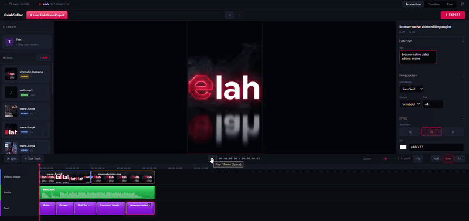

# Elah

**A browser-native, frame-accurate video editing engine for the web.** A framework-agnostic core — timeline, WebGL2 renderer, media pipeline, and MP4 export — with thin UI bindings on top. **React is the first UI layer** (shipping today); the engine knows nothing about it, so React Native and other frameworks can bind to the same core. The same engine also runs **headless**: [`@elah/cli`](./packages/cli) builds and renders projects from the command line, a Node API, or a long-lived HTTP render server (`elah serve`) — so AI backends can generate videos with no UI at all. Works for any aspect ratio (9:16 Reels, 16:9 YouTube, 1:1, or any custom stage).

[](https://www.npmjs.com/package/@elah/editor)
[](./BUNDLE_STRATEGY.md)
[](./LICENSE)
[](https://www.npmjs.com/package/@elah/editor)

[**Website**](https://www.elah.dev) · [**Docs**](https://www.elah.dev/docs) · [**Playground**](https://www.elah.dev/playgrounds) · [**Changelog**](https://www.elah.dev/changelog) · [**npm**](https://www.npmjs.com/package/@elah/editor) · [**Discord**](https://discord.gg/8CeZ2XbPy)



Using the React layer (`@elah/editor`):

```bash
npm install @elah/editor lucide-react
```

```tsx
// Import all three stylesheets once at your app root — each package compiles
// its own, so they do not contain each other's classes.
import '@elah/timeline/styles.css'
import '@elah/editor/styles.css'
import '@elah/editor/styles/tokens.css'

import { EditorProvider, Preview, Timeline, AssetPanel, createDefaultDemuxerFactory } from '@elah/editor'

const demuxerFactory = createDefaultDemuxerFactory()

export default function App() {
  return (
    <EditorProvider fps={30}>
      {/* elah-root scopes the --elah-* design tokens */}
      <div className="elah-root" style={{ display: 'flex', height: '100vh' }}>
        <AssetPanel style={{ width: 220 }} />
        <Preview demuxerFactory={demuxerFactory} style={{ height: 480 }} />
        <Timeline style={{ height: 300 }} />
      </div>
    </EditorProvider>
  )
}
```

That's a working editor: drag a file into the asset panel, drop it on the timeline, hit **Space** to play. See [Install](#install) for the package layers and [How to use the SDK](#how-to-use-the-sdk-in-your-own-app) for more — or skip the UI entirely and render from a JSON spec with the [headless CLI & render server](#headless-cli-node-api--render-server).

### Building with an AI coding tool?

Point it at **[`docs/ai/ELAH_FOR_AI_AGENTS.md`](./docs/ai/ELAH_FOR_AI_AGENTS.md)** — one self-contained file with the full API surface, bundler setup for Vite and Next.js, 12 copy-paste recipes, and the mistakes that produce silently-broken editors. It needs no checkout, so it works for Lovable, Google AI Studio, Emergent, and v0 as well as for repo-aware agents.

Agents working *inside this repo* should read [`AGENTS.md`](./AGENTS.md). Each example app in [`playground/`](./playground) has its own scoped `AGENTS.md`, and [`playground/minimal`](./playground/minimal) is the smallest complete editor to start a custom UI from.

---

## What this is

Elah is an open architecture for building a **browser-native video editor** on top of React. It is aspect-ratio agnostic by design — the same engine drives **9:16 vertical content** (Reels / Shorts / TikTok), **16:9 landscape content** (YouTube, long-form), **1:1 square**, or any custom stage size. It is **not** a UI framework or a clone of a specific product; it is the **engine, resolver, and timeline SDK** that any modern web-based video editor should sit on.

Three goals shape every decision:

1. **Deterministic playback.** Same project + same frame = same pixels, always.
2. **Renderer-agnostic core.** The data model and timeline resolver know nothing about DOM, Canvas, WebGL, or WebGPU. Swap rendering backends without touching state.
3. **Iteration speed.** Small surface area, no plugin systems, no over-engineered abstractions. You can read the entire core in one sitting.

---

## Status

| Layer | Status |
|---|---|
| Timeline data model (`Clip`, `Track`, `Project`) | ✅ Stable, frame-based |
| `TimelineEngine` (Immer + history + events + batch) | ✅ Stable |
| `PlaybackEngine` (RAF clock + subscribe) | ✅ Stable |
| `resolveTimeline(frame, project) → Scene` (pure resolver) | ✅ Stable, solo/mute/zIndex correct |
| Timeline UI (`Timeline`, `Ruler`, `TrackRow`, `ClipBlock`, `Playhead`) | ✅ Working |
| Media import + library store | ✅ Working |
| Media gallery UI + drag-drop | ✅ Working |
| **WebGL2 GPU renderer** (`GpuRenderer`, `RenderGraph`, `VideoLayer`, `ImageLayer`, `TextLayer`) | ✅ Working — textured-quad compositing, context-loss recovery |
| **Real video playback** (WebCodecs decode + mediabunny demux) | ✅ Working — push-based `StreamingFrameProducer`, copy-and-close frame cache |
| **`<Preview>` component** (mounts renderer + drives RAF) | ✅ Working — library component in `@elah/editor` |
| **Project aspect ratio / letterbox** | ✅ Working — canvas `gl.viewport` contain-fit + per-clip object-fit **contain** (off-aspect clips letterboxed *within* the frame, never stretched); switchable stage aspect via `TimelineEngine.setStage` (16:9 ↔ 9:16) with a `<StageBorder>` frame outline |
| **Text overlays** (GPU `TextLayer` + interactive `TextOverlay`) | ✅ Working — paint via 2D-canvas→texture; drag / resize / inline-edit; `transform.scale` (re-rasterized to stay crisp) + `transform.rotation` applied |
| **Video & image transform overlay** (`MediaTransformOverlay`) | ✅ Working — click-select, drag-move, corner-drag uniform scale for video and image clips; `transform` flows to both renderers so export matches preview automatically |
| **Audio playback** (`AudioPlaybackController` on the `PlaybackEngine` clock) | ✅ Working — **multi-track**, per-clip control, master/track volume via `useAudioMixer` / `useTrackLevels` / `useMasterVolume` (from `@elah/react`); mounted by `<Preview enableAudio>` |
| **Image clips** (GPU `ImageLayer`) | ✅ Working — static image load → textured quad, same object-fit contain as video; decode cache warming (`warmImageSrc`, `preloadProjectImages`) |
| **Shape & freehand clips** (GPU `ShapeLayer`, `FreehandLayer`) | ✅ Working — `createShapeClip` / `createFreehandClip`; resolver exposes `scene.shapes` + `scene.freehand`; interactive `ShapeOverlay` for select / move / scale |
| **Timeline thumbnails + waveforms** | ✅ Working — filmstrip tiles per clip (4-frame strip, tiled by zoom), real waveform peaks from `decodeAudioData`; both generated once per asset and cached on `MediaAsset` |
| **Audio-on-drop dialog** | ✅ Working — dropping a video with audio shows a 3-choice modal (Video+Audio / Video only / Audio only); both clips added in one `engine.batch` (one undo) |
| **Export pipeline** (`exportVideo` → MP4) | ✅ Working — module worker renders frames to `OffscreenCanvas` (reusing `resolveTimeline` + shared placement math) and muxes via mediabunny; audio mixed on the main thread |
| **Headless CLI** (`@elah/cli` — `split` / `trim` / `build` / `export`) | ✅ Working — engine edits in plain Node; `export` runs core's real `exportVideo` in headless Chrome, so CLI output matches editor output by construction |
| **AI build spec** (`elah build --spec spec.json --export out.mp4`) | ✅ Working — seconds-based JSON spec → validated project via `TimelineEngine`; path-addressed errors (`clips[2].duration must be …`) a generating model can self-correct from |
| **HTTP render server** (`elah serve` + Docker) | ✅ Working — long-lived warm-browser session; `POST /render` takes a build spec, returns MP4 bytes; `/healthz`, `--concurrency` guard with `503 + Retry-After`; Dockerfile ships Chrome + fonts |
| **Fade transitions** | ✅ Working — snapshot-overlay architecture: resolver sets `fromClip.opacity=0`/`toClip.opacity=1`; `TransitionOverlay` fades a frozen canvas snapshot via CSS; export mirrors with `globalAlpha=1-t` |
| Slide / wipe transitions | 🟡 Partial — architecture in place; only fade implemented |
| Rotation handle for video/image | 🟡 Partial — `transform.rotation` already flows through both renderers; interactive overlay handle not yet built |
| Scheduler / predictive frame caching | ⚪ Not started — next architectural layer |

See [`ROADMAP.md`](./ROADMAP.md) for current state and the next layer,
[`CURRENT_LIMITATIONS.md`](./CURRENT_LIMITATIONS.md) for known gaps, and
[`packages/core/src/renderer/architecture.md`](./packages/core/src/renderer/architecture.md)
for the GPU render + decode pipeline in depth.

> **Single-video-track is the current v1 constraint** — the video decode
> pipeline is not yet designed for multi-track *video* compositing. Audio is
> multi-track as of 0.3.0.

---

## Architecture (one paragraph)

A single immutable `Project` tree owns all timeline data. The framework-agnostic `TimelineEngine` is the only place mutations happen — every edit is an Immer-backed commit with structural sharing, history, batching, and typed events. Time is **integer frames**; never floating-point seconds. A standalone `PlaybackEngine` owns the RAF loop and emits `(frame, isPlaying)` snapshots; React is a downstream consumer via Zustand mirrors. A pure function `resolveTimeline(frame, project) → Scene` determines what is visible and audible at any given frame — this is the only thing renderers consume. The shipped renderer is a **WebGL2 `GpuRenderer`** that turns each `Scene` into a sorted list of textured-quad draws across registered layers (`VideoLayer`, `ImageLayer`, `TextLayer`, `ShapeLayer`, `FreehandLayer`), composited by global `zIndex`; video frames come from a push-based WebCodecs decode pipeline (`StreamingFrameProducer`) that decodes ahead of the playhead and **copies each frame to an `ImageBitmap`** before caching it, so the decoder's hardware output pool never starves. Audio is **not** rendered through the GPU — an `AudioPlaybackController` reads `scene.audios` and schedules Web Audio across **multiple tracks** (per-clip and master volume) beside the renderer on the same `PlaybackEngine` clock. Export reuses the exact same resolution: a worker steps `resolveTimeline` frame-by-frame and draws to an `OffscreenCanvas` using the *same* placement math (`resolveDrawRect`, `computeTextLayout`) as the live renderer, then muxes MP4 with mediabunny — so preview and export never drift. Any renderer implements the same `Renderer` interface and reads only the `Scene`.

For the full architecture document, see [`ARCHITECTURE.md`](./ARCHITECTURE.md).

---

## Repository layout

```
elah/
├── README.md                     # this file
├── CHANGELOG.md                  # per-release changes (all three packages)
├── ARCHITECTURE.md               # the engine architecture in depth
├── ROADMAP.md                    # current state + next architectural layer
├── CURRENT_LIMITATIONS.md        # known gaps and trade-offs
├── PERFORMANCE.md                # performance philosophy + techniques
├── BUNDLE_STRATEGY.md            # dependency budget + tree-shaking + measured sizes (~63 KiB gz full SDK)
├── CONTRIBUTING.md               # branch/commit conventions, PR rules
├── AGENTS.md                     # brief for coding agents working in this repo
├── docs/
│   └── ai/
│       └── ELAH_FOR_AI_AGENTS.md # self-contained SDK guide for AI tools (no checkout needed)
├── apps/
│   └── web/                      # Next.js site + docs + playgrounds (www.elah.dev)
├── playground/
│   ├── minimal/                  # smallest complete editor — start here for a custom UI
│   ├── next/                     # production editor on Next.js (App Router)
│   └── react/                    # production editor on Vite + React
└── packages/
    ├── core/                     # @elah/core — framework-agnostic engine
    │   └── src/
    │       ├── editor/           # TimelineEngine (Immer commits, history, events)
    │       ├── playback/         # PlaybackEngine (RAF clock)
    │       ├── resolver/         # resolveTimeline(frame, project) → Scene
    │       ├── elements/         # clip factories (video/audio/text/image/shape/freehand)
    │       ├── media/            # WebCodecs decode, FrameCache, mediabunny demux, audio mixer
    │       ├── renderer/         # Renderer interface + WebGL2 GpuRenderer, layers
    │       ├── export/           # exportVideo + ExportWorker (OffscreenCanvas → MP4)
    │       ├── assets/           # media library store + import (files / url / blob)
    │       ├── stores/           # Zustand mirrors of engine state
    │       └── debug/            # channel-based trace logging
    ├── react/                    # @elah/react — React bindings (context, store hooks, audio hooks)
    ├── timeline/                 # @elah/timeline — Timeline, Ruler, TrackRow, ClipBlock, hooks
    ├── editor/                   # @elah/editor — EditorProvider, Preview, AssetPanel, SourcePanel
    └── cli/                      # @elah/cli — headless split/trim/build/export + `elah serve` render server (Dockerfile included)
docs/
├── glossary.md                   # terminology
├── known-bugs.md                 # deliberate workarounds + their real fixes
├── design-tokens.md              # timeline color/theme token system
└── deploy-render-server.md       # `elah serve` contract, security notes, deployment options
```

---

## Run locally

Cloning the repo to develop Elah itself (not just consume the npm package):

```bash
git clone https://github.com/elahlabs/elah.git
cd elah
npm install
npm run build:packages   # build @elah/core, @elah/timeline, @elah/editor
npm run dev              # starts apps/web at http://localhost:3001
npm run typecheck
```

> The apps consume the **built `dist/`** of each `@elah/*` package, so after
> editing package source run `npm run build:packages` again to see the change.

Then open the editor, drag a file into the asset panel, drop it on the timeline, and hit **Space** to play. Keyboard shortcuts:

| Key | Action |
|---|---|
| **Space** | Play / pause |
| **S** | Split selected clip at playhead |
| **Delete** / **Backspace** | Delete selected clip(s) |
| **Ctrl/Cmd + C** | Copy selected clip(s) |
| **Ctrl/Cmd + V** | Paste copied clip(s) at playhead |
| **Ctrl/Cmd + Z** | Undo |
| **Ctrl/Cmd + Shift + Z** / **Ctrl/Cmd + Y** | Redo |
| **Ctrl/Cmd + scroll** | Zoom timeline |
| **← / →** | Step one frame back / forward |

Right-click any clip on the timeline to open the context menu (Delete).

---

## Install

Elah ships as five published npm packages:

| Package | npm | What it is |
|---|---|---|
| [`@elah/editor`](https://www.npmjs.com/package/@elah/editor) | [](https://www.npmjs.com/package/@elah/editor) | Full React editor SDK — `EditorProvider`, `Preview`, `Timeline`, `AssetPanel` + re-exports everything below |
| [`@elah/timeline`](https://www.npmjs.com/package/@elah/timeline) | [](https://www.npmjs.com/package/@elah/timeline) | React timeline UI components and hooks |
| [`@elah/react`](https://www.npmjs.com/package/@elah/react) | [](https://www.npmjs.com/package/@elah/react) | React bindings — editor context, store hooks, and audio mixer hooks (used by `@elah/timeline` and `@elah/editor`, or standalone) |
| [`@elah/core`](https://www.npmjs.com/package/@elah/core) | [](https://www.npmjs.com/package/@elah/core) | Framework-agnostic engine, resolver, renderer, export (headless) |
| [`@elah/cli`](https://www.npmjs.com/package/@elah/cli) | [](https://www.npmjs.com/package/@elah/cli) | Headless `elah` command-line runtime — split/trim/build/export/serve on `@elah/core` |

For the full experience, install `@elah/editor` — it pulls in the other three:

```bash
npm install @elah/editor
# or: pnpm add @elah/editor  /  yarn add @elah/editor
```

Peer dependencies: `react`, `react-dom` >= 18.

Use `@elah/core` directly if you only need the headless engine for a custom renderer or export pipeline. Use `@elah/cli` if you want a ready-made command-line/server runtime (`elah build --spec spec.json --export out.mp4`, or `elah serve` for an HTTP render endpoint) instead of scripting against `@elah/core` yourself.

---

## How to use the SDK in your own app

```tsx
import { EditorProvider, Timeline, AssetPanel, type TimelineRef } from '@elah/editor'
import { useRef } from 'react'

function App() {
  const ref = useRef<TimelineRef>(null)

  const addClip = () => {
    const engine = ref.current?.engine
    if (!engine) return
    const track = engine.addTrack('video')
    engine.addClip({
      trackId: track.id,
      type: 'video',
      name: 'My clip',
      startFrame: 0,
      durationFrames: 90,
    })
  }

  return (
    <EditorProvider fps={30}>
      <button onClick={addClip}>Add clip</button>
      <div style={{ display: 'flex', height: 400 }}>
        <AssetPanel style={{ width: 220 }} />
        <Timeline ref={ref} fps={30} style={{ flex: 1 }} />
      </div>
    </EditorProvider>
  )
}
```

### Rendering pixels with `<Preview>`

`<Preview>` mounts the WebGL2 renderer and drives the RAF loop for you. It reads
the engines from `EditorProvider` context and renders the resolved `Scene` to a
canvas (letterboxed to the project aspect) — video **and** text clips, composited by
`zIndex`. It also paints interactive transform overlays — drag / resize / inline-edit for text clips, and drag / uniform-scale for video & image clips — and plays the project's audio track in sync (toggle with
`enableAudio`, default on). You pass a **demuxer factory** — the bundled
`createDefaultDemuxerFactory()` wires up mediabunny for you, while advanced
consumers can swap in their own decode backend:

```tsx
import { EditorProvider, Preview, createDefaultDemuxerFactory } from '@elah/editor'

const demuxerFactory = createDefaultDemuxerFactory()

function App() {
  return (
    <EditorProvider fps={30}>
      <Preview demuxerFactory={demuxerFactory} style={{ height: 480 }} />
      {/* timeline, asset panel, transport controls of your choosing */}
    </EditorProvider>
  )
}
```

To consume the resolver directly (for a custom renderer or export pipeline):

```ts
import { resolveTimeline } from '@elah/editor'

const scene = resolveTimeline(currentFrame, engine.getProject())
// scene.videos, scene.audios, scene.texts, scene.images, scene.transitions
```

---

## Headless: CLI, Node API & render server

The engine also runs with **no UI at all** via [`@elah/cli`](./packages/cli) — built for automation and AI-generation pipelines. `split`, `trim`, and `build` run in plain Node; `export` runs core's real `exportVideo` pipeline in headless Chrome, so CLI output is identical to editor output by construction.

**Spec → MP4 in one command.** `elah build` consumes a seconds-based JSON spec (the AI-generation contract), probes each asset's real duration, and constructs the project through `TimelineEngine` — so overlaps, track caps, and source bounds are validated with path-addressed errors (`clips[2].duration must be …`) that a generating model can self-correct from:

```jsonc
// spec.json — times in seconds, assets by path or URL
{
  "fps": 30,
  "assets": { "footage": "./media/clip.mp4", "music": "./media/song.mp3" },
  "clips": [
    { "track": "video", "asset": "footage", "start": 0, "duration": 8 },
    { "track": "text", "text": "Hello", "start": 0.5, "duration": 4, "fontSize": 96 },
    { "track": "audio", "asset": "music", "start": 0, "duration": 8, "volume": 0.5 }
  ]
}
```

```bash
npx @elah/cli build --spec spec.json --export final.mp4
```

**Long-lived render server.** `elah serve` keeps a warm browser across requests — each render pays for a new tab, not a fresh Chrome launch. `POST /render` takes a build spec and returns the MP4 bytes:

```bash
elah serve --port 8080 --concurrency 2 --media-root ./assets
curl -X POST --data-binary @spec.json http://127.0.0.1:8080/render -o out.mp4
```

A [`Dockerfile`](./packages/cli/Dockerfile) that installs Chrome + fonts and runs `elah serve` ships with the package — see [`docs/deploy-render-server.md`](./docs/deploy-render-server.md) for the full contract, security notes, and deployment options.

**Importable, too.** Everything the CLI does is available as a Node API (`build`, `exportProject`, and `createRenderSession()` for warm-browser reuse) — see the [`@elah/cli` README](./packages/cli/README.md) for the full command reference, spec rules, and library API.

---

## Design philosophy

- **Engine-first.** The core is plain TypeScript. React is a consumer, not a master.
- **Frames, not seconds.** Integer time eliminates a class of floating-point bugs that haunt every NLE.
- **One mutation funnel.** All edits go through `TimelineEngine.commit()`. No back-doors.
- **Pure resolver.** `resolveTimeline` is deterministic and side-effect-free, so it can run in tests, workers, and export pipelines without ceremony.
- **Renderer is just a consumer.** A renderer reads `Scene`, writes pixels, and knows nothing else.
- **Small surface area.** No plugin systems, no event buses, no dependency injection. Until proven needed.

For the longer treatment, see [`ARCHITECTURE.md`](./ARCHITECTURE.md).

---

## Analytics & privacy

The published website uses opt-in product analytics (PostHog) and a Reddit
pixel — both gated behind a consent banner and disabled under Do-Not-Track, and
inert unless their `NEXT_PUBLIC_*` variables are set (see
[`.env.example`](./.env.example)). The elah libraries ship no telemetry. Full
details on the [Analytics docs page](https://www.elah.dev/docs/analytics).

---

## Contributing

The foundation and the first feature wave have shipped; work now is feature and
hardening PRs against a live engine. Start from [`ROADMAP.md`](./ROADMAP.md) and
[`CURRENT_LIMITATIONS.md`](./CURRENT_LIMITATIONS.md), then see
[`CONTRIBUTING.md`](./CONTRIBUTING.md) for branch/commit conventions, PR rules,
and the architectural invariants every renderer/decode change must preserve.

---

## Community & support

- **Discord** — [join the server](https://discord.gg/8CeZ2XbPy) for questions, help, and discussion.
- **Issues** — [github.com/elahlabs/elah/issues](https://github.com/elahlabs/elah/issues)
- **Commercial licensing & support** — [paul@elah.dev](mailto:paul@elah.dev)

---

## License

Copyright (c) 2026 Elah Labs Private Limited. See [`LICENSE`](./LICENSE).
