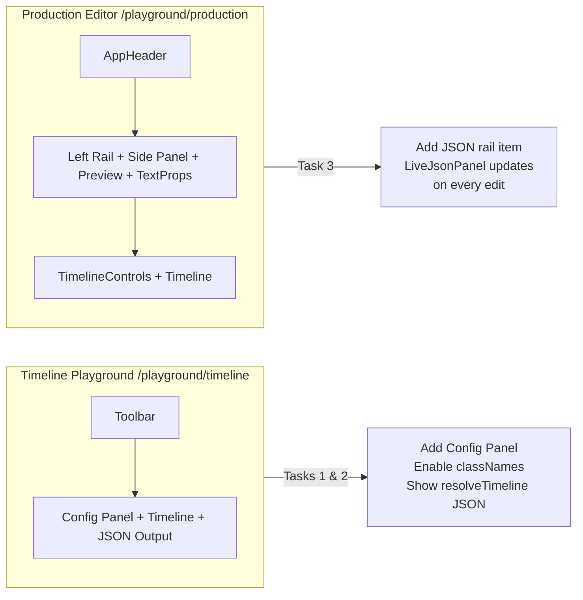
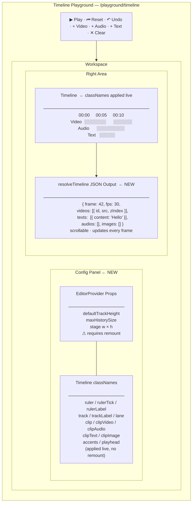
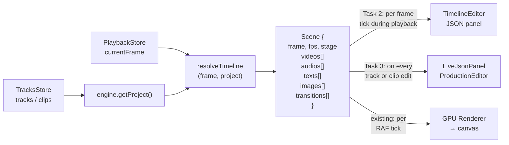
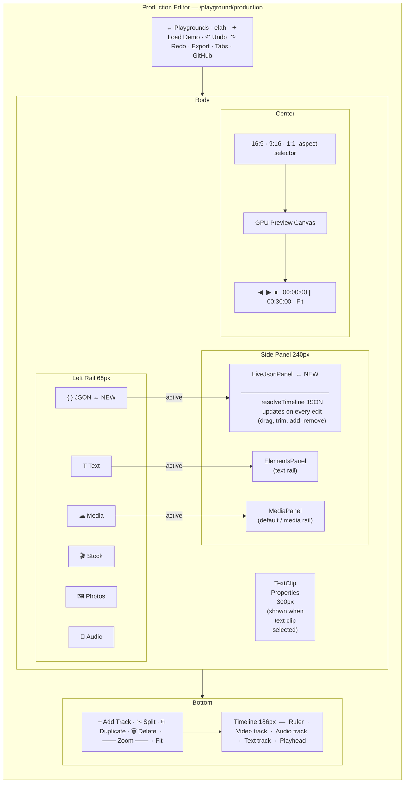

# Playground Tasks — Vishwajeet

Tasks for improving the two playground views: `/playground/timeline` (Timeline-only) and the left panel in `/playground/production` (Production Editor).

---

## Overview — What We're Building



---

## Task 1 — Enable All UI Configs on the Timeline Playground

**File:** `apps/web/components/playground/timeline/TimelineEditor.tsx`

The `<Timeline>` component accepts a `classNames` prop (`TimelineClassNames`) and the wrapping `<EditorProvider>` has additional configuration props. None of these are currently wired up in the playground — everything uses defaults. Add UI controls to let users toggle/tweak each config live.

### Timeline `classNames` slots to expose

These map to the `classNames` prop on `<Timeline>` (type: `TimelineClassNames` from `@elah/timeline`):

| Slot | Controls | Description |
|---|---|---|
| `root` | free-form class input | Outer wrapper (e.g. `rounded-xl`) |
| `ruler` | color picker / preset classes | Ruler strip background |
| `rulerTick` | color picker / preset classes | Tick marks in the ruler |
| `rulerLabel` | color picker / preset classes | Timecode labels |
| `track` | free-form class input | Each track row container |
| `trackLabel` | free-form class input | Track-label sidebar per row |
| `lane` | color picker / preset classes | Clip lane background |
| `clip` | free-form class input | Clip block shape/shadow (all types) |
| `clipVideo` | gradient preset | Video clip body gradient (`from-* to-*`) |
| `clipAudio` | gradient preset | Audio clip body gradient |
| `clipText` | gradient preset | Text clip body gradient |
| `clipImage` | gradient preset | Image clip body gradient |
| `clipVideoAccent` | color text class | Video clip stripe + selected border |
| `clipAudioAccent` | color text class | Audio clip accent |
| `clipTextAccent` | color text class | Text clip accent |
| `clipImageAccent` | color text class | Image clip accent |
| `playhead` | color text class | Playhead needle color (uses `currentColor`) |

> **Note on color slots:** Clip bodies take a `from-*/to-*` gradient or `bg-*`. Accent/playhead slots take a `text-*` class since those elements paint from `currentColor`.

### `EditorProvider` configs to expose

These are props on `<EditorProvider>`:

| Prop | Type | Default | Description |
|---|---|---|---|
| `defaultTrackHeight` | `number` | 36 | Height in px of each track row |
| `maxHistorySize` | `number` | engine default | Max undo history entries |
| `stage.width` / `stage.height` | `number` | 1920 × 1080 | Canvas/stage dimensions |

Because `EditorProvider` memoizes the engine once on mount, `stage`, `defaultTrackHeight`, and `maxHistorySize` can only be applied on mount. Wire these as controls that require a remount (show a "Remount to apply" note next to them, or implement a key-based remount).

### Suggested UI layout

Add a collapsible config panel (sidebar or drawer) next to the timeline area. Group controls into three sections:

1. **Provider Config** — `defaultTrackHeight`, `maxHistorySize`, stage size (with remount warning)
2. **Timeline classNames** — one input/picker per slot above, live-applied
3. **Zoom** — the zoom slider already exists in the toolbar; keep it there

Apply `classNames` changes live by passing them as state to the `<Timeline classNames={...} />` prop — no remount needed.



---

## Task 2 — Show `resolveTimeline` JSON Output (Timeline Playground)

**File:** `apps/web/components/playground/timeline/TimelineEditor.tsx`

Currently there is no output panel. Instead of adding a preview screen (no renderer is wired in the timeline playground), show the live JSON output of `resolveTimeline`.

### What `resolveTimeline` returns

```ts
// packages/core/src/resolver/resolveTimeline.ts
resolveTimeline(frame: number, project: Project): Scene
```

The `Scene` shape:
```ts
{
  frame: number
  fps: number
  stage: { width: number; height: number }
  videos: ActiveVideoClip[]    // clips active at this frame
  audios: ActiveAudioClip[]
  texts:  ActiveTextClip[]
  images: ActiveImageClip[]
  shapes: ActiveShapeClip[]
  freehand: ActiveFreehandClip[]
  transitions: ActiveTransition[]
}
```

### Data flow



### Implementation

- Import `resolveTimeline` from `@elah/core`
- Subscribe to `usePlaybackStore` for `currentFrame` and `useTracksStore` for the project (call `engine.getProject()`)
- On every frame tick, call `resolveTimeline(currentFrame, engine.getProject())` and store in state
- Render the JSON in a scrollable panel below (or to the right of) the timeline

```tsx
// Rough shape — adapt to fit layout
const scene = resolveTimeline(currentFrame, engine.getProject())
<pre className="text-xs font-mono overflow-auto">
  {JSON.stringify(scene, null, 2)}
</pre>
```

**When to update:** Subscribe to `usePlaybackStore` so it updates every frame during playback. Also update on any `useTracksStore` change (clip add/remove/move).

> The output fires on play — the JSON should animate as the frame advances and clips enter/leave the scene.

---

## Task 3 — Live JSON Output for the Left Panel (Production Editor)

**File:** `apps/web/components/playground/production/ProductionEditor.tsx`

Mirror Task 2, but for the Production Editor's left panel. Instead of firing only on play, the JSON should update **continuously** as the user edits — whenever tracks, clips, or their properties change.

### Where to show it

The left panel currently hosts `<MediaPanel>` or `<ElementsPanel>` depending on the active left-rail item (Media / Stock / Photos / Audio / Text). Add a new rail item — e.g. **"JSON"** with a `Code2` or `Braces` icon — that swaps the panel to a JSON viewer.



```tsx
// In RAIL_ITEMS (ProductionEditor.tsx)
{ id: 'json', label: 'JSON', Icon: Braces }  // import Braces from 'lucide-react'
```

In the panel area (currently the 240px-wide sidebar), when `activePanel === 'json'`, render the live JSON viewer:

```tsx
{activePanel === 'json' ? (
  <LiveJsonPanel />
) : activePanel === 'text' ? (
  <ElementsPanel style={{ flex: 1, minHeight: 0 }} />
) : (
  <MediaPanel style={{ flex: 1, minHeight: 0 }} />
)}
```

### `LiveJsonPanel` implementation

```tsx
function LiveJsonPanel() {
  const engine = useTimelineEngine()
  const tracks = useTracksStore((s) => s.tracks)     // re-renders on any track/clip change
  const currentFrame = usePlaybackStore((s) => s.currentFrame)

  const scene = resolveTimeline(currentFrame, engine.getProject())

  return (
    <div style={{ flex: 1, minHeight: 0, overflow: 'auto', padding: '8px' }}>
      <pre style={{ fontSize: 10, fontFamily: 'monospace', whiteSpace: 'pre-wrap', wordBreak: 'break-all' }}>
        {JSON.stringify(scene, null, 2)}
      </pre>
    </div>
  )
}
```

**Key difference from Task 2:** Update triggers on `useTracksStore` changes (every edit), not only on playback. This makes the JSON reflect the current state as the user drags clips, changes properties, etc.

---

## Relevant Files

| File | Purpose |
|---|---|
| `apps/web/components/playground/timeline/TimelineEditor.tsx` | Timeline-only playground (Tasks 1 & 2) |
| `apps/web/components/playground/production/ProductionEditor.tsx` | Full production editor (Task 3) |
| `packages/timeline/src/classNames.ts` | `TimelineClassNames` interface — all slot names and docs |
| `packages/timeline/src/Timeline.tsx` | `TimelineProps` — `classNames`, `fps`, `className`, `style` |
| `packages/editor/src/editor/EditorProvider.tsx` | `EditorProviderProps` — `fps`, `stage`, `defaultTrackHeight`, `maxHistorySize`, `initialTracks` |
| `packages/core/src/resolver/resolveTimeline.ts` | `resolveTimeline(frame, project): Scene` |
| `packages/core/src/resolver/scene.ts` | `Scene` type + active clip shapes |

---

## Quick Reference — Imports

```ts
// resolveTimeline + Scene type
import { resolveTimeline } from '@elah/core'
import type { Scene } from '@elah/core'

// Stores
import { useTracksStore, usePlaybackStore } from '@elah/editor'

// Timeline classNames type
import type { TimelineClassNames } from '@elah/timeline'
```
