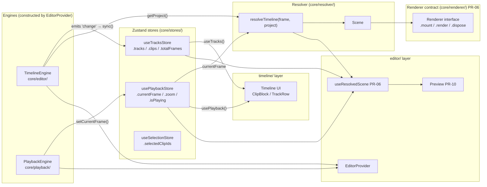

# `core/` Architecture Reference

> **Purpose of this document:** A self-contained cold-start reference for any
> implementation agent working on `@elah/editor`. Load this file and you will
> not need to re-explore `packages/editor/src/core/` from scratch.
>
> **Last updated:** PR-06 (Renderer interface + useResolvedScene + useTimelineDrop stubs).

---

## 1. Position in the three-layer architecture

```
packages/editor/src/
  core/       ← THIS DOCUMENT — runtime; React-agnostic where possible
  timeline/   ← timeline UI surface; may import from core/, not editor/
  editor/     ← composition: EditorProvider, hooks, Preview, AssetPanel
```

**Dependency rule (enforced by convention + future lint):**

```
core  ←  timeline  ←  editor
```

- `core/` may **not** import from `timeline/` or `editor/`.
- `timeline/` may **not** import from `editor/`.
- `editor/` may import from both.

---

## 2. Directory map

| Folder | Role | Key exports |
|--------|------|-------------|
| `core/types/` | Shared domain types. All time values are integer frame counts. | `Project`, `Track`, `Clip`, `Transform`, `ClipType`, `TrackKind`, `EngineEvent` |
| `core/editor/` | `TimelineEngine` — the authoritative project state machine. Immer mutations, undo/redo history, event emitter. | `TimelineEngine` |
| `core/playback/` | `PlaybackEngine` — frame ticker, RAF loop, transport controls. Reads `currentFrame` from `PlaybackStore` and advances it. | `PlaybackEngine` |
| `core/resolver/` | Pure, deterministic frame resolver. `resolveTimeline(frame, project) → Scene`. No DOM, no React. | `resolveTimeline`, `Scene` (and sub-types) |
| `core/renderer/` | `Renderer` interface contract — added PR-06. No implementation yet. Implementations arrive in PR-10 (`DomRenderer`). | `Renderer` |
| `core/stores/` | Zustand stores that mirror engine state into React. Components subscribe with granular selectors. | `useTracksStore`, `usePlaybackStore`, `useSelectionStore` |
| `core/media/` | `MediaLibrary` — in-memory asset registry. Zustand store + typed hooks. Drag MIME constant. | `useMediaLibrary`, `useMediaLibraryStore`, `MEDIA_DRAG_MIME`, `MediaAsset` |
| `core/elements/` | Clip factory functions. Pure constructors, no side-effects. | `createVideoClip`, `createAudioClip`, `createTextClip`, `createImageClip` |
| `core/track/` | Track factory. | `createTrack` |
| `core/actions/` | Compound operations (multi-step mutations + engine calls). Currently: `splitClipAtPlayhead`. | `splitClipAtPlayhead` |
| `core/visitor/` | Immer-based project mutation primitives. Used internally by `TimelineEngine`. Not exported publicly. | `addClip`, `removeClip`, `updateClip`, `splitClip`, `cloneClip`, `removeTrack`, `updateTrack` |
| `core/utils/` | Pure helpers: frame math, timecode formatting, snap, ID generation. | `framesToTimecode`, `secondsToFrames`, `framesToSeconds`, `getTotalFrames`, `generateId` |
| `core/editor-context.ts` | React context + hooks that expose the engines to the component tree. Lives in `core/` so `editor/` and `timeline/` can both import without a circular dependency. | `useEditor`, `useTimelineEngine`, `usePlaybackEngine`, `EditorContext` |

---

## 3. Key type relationships

```
TimelineConfig
    │
    ▼ (constructor)
TimelineEngine
    │
    ├── getProject() ──────────────► Project
    │                                   │
    │                              ┌────┴─────┐
    │                           Track[]    clips: Record<trackId, Clip[]>
    │
    └── on('change', handler) ──► Project  (emitted after every mutation)

resolveTimeline(frame: number, project: Project) ──► Scene
                                                         │
                                          ┌──────────────┼──────────────────┐
                                    ActiveVideoClip[]  ActiveAudioClip[]  ActiveTextClip[]
                                    ActiveImageClip[]  SceneTransition[]

Renderer (interface, PR-06)
    ├── mount(container: HTMLElement)
    ├── render(scene: Scene)           ◄── consumes only Scene; never Project
    └── dispose()
```

**`Clip` fields** worth knowing:

| Field | Meaning |
|-------|---------|
| `startFrame` | Position on the timeline (frame index where the clip starts) |
| `durationFrames` | Length of the clip on the timeline |
| `sourceStartFrame` | Trim in-point into the source asset |
| `sourceDurationFrames` | Full length of the source asset (for trim constraints) |
| `assetId?` | Reference to a `MediaAsset` in the `MediaLibrary` (preferred over raw `src` when set) |
| `transform?` | Normalized spatial transform `{x, y, scale, rotation, anchor}` — undefined means renderer default |

---

## 4. Runtime data-flow diagram



---

## 5. Store contracts

### `useTracksStore` (`core/stores/tracks.store.ts`)

Mirrors `Project` from the engine into React. **Never mutate directly** — always go through the engine.

| Field | Type | Description |
|-------|------|-------------|
| `tracks` | `Track[]` | Reference changes on every engine `'change'` event |
| `clips` | `Record<string, Clip[]>` | Indexed by `trackId` |
| `totalFrames` | `number` | Computed max end frame across all clips |
| `canUndo` / `canRedo` | `boolean` | Engine history state |
| `sync(project, meta)` | method | Called by `<Timeline>` in its engine `'change'` listener |

The `tracks` reference replacement on every `sync()` call is the cheapest "project mutated" signal. `useResolvedScene` subscribes to it via `useTracksStore((s) => s.tracks)` purely for this trigger.

### `usePlaybackStore` (`core/stores/playback.store.ts`)

Partially persisted to `localStorage` key `myeditor-playback`. Persisted fields: `zoom`, `volume`, `muted`, `playbackRate`, `loop`, `snapEnabled`.

| Field | Description |
|-------|-------------|
| `currentFrame` | Current playhead position (integer frames) |
| `currentFrameEpoch` | Monotonically incremented counter; detects repeat seeks to the same frame |
| `isPlaying` | Transport state |
| `zoom` | Pixels per frame (timeline zoom level) |
| `snapEnabled` | Snap-to-grid toggle |

### `useSelectionStore` (`core/stores/selection.store.ts`)

Holds `selectedClipIds: string[]`. Not mirrored from the engine — selection is a pure UI concern.

---

## 6. `TimelineEngine` event model

The engine is a typed event emitter. Listeners registered with `.on(event, handler)` are called synchronously after each mutation.

| Event | Payload | When fired |
|-------|---------|------------|
| `'change'` | `Project` | After **every** mutation (broadest trigger) |
| `'track:added'` | `Track` | After `addTrack()` |
| `'track:removed'` | `string` (trackId) | After `removeTrack()` |
| `'clip:added'` | `Clip` | After `addClip()` |
| `'clip:removed'` | `{ clipId, trackId }` | After `removeClip()` |
| `'clip:updated'` | `Clip` | After `updateClip()`, `moveClip()`, `trimClip()` |
| `'clip:split'` | `{ leftId, rightId, trackId }` | After `splitClip()` |
| `'history:change'` | `{ canUndo, canRedo }` | After any mutation or undo/redo |

`<Timeline>` subscribes to `'change'` and calls `useTracksStore.sync()`. That is the only bridge between the engine and React stores.

---

## 7. `resolveTimeline` guarantees

- **Pure and deterministic** — same `(frame, project)` always produces structurally equal output.
- **No side-effects** — safe in tests, Web Workers, WASM export pipelines.
- **No DOM, no React, no Zustand** — plain data in, plain data out.
- Respects `track.disabled`, `clip.disabled`, `track.muted`, `track.solo`.
- Output arrays are sorted ascending by `zIndex`; index 0 = furthest back, last = front.
- `zIndex` is derived from `track.order` × 1000, leaving room for future sub-layer offsets.

---

## 8. `MediaLibrary` (`core/media/`)

In-memory registry of source assets. Not yet persisted (PR-07+ adds thumbnails and optional persistence).

- `useMediaLibrary()` — React hook, full library operations (`addAsset`, `removeAsset`, `getAsset`, etc.)
- `useMediaLibraryStore` — raw Zustand store for granular subscriptions
- `MEDIA_DRAG_MIME = 'application/x-elah-media'` — MIME type placed on `dataTransfer` when dragging from `AssetPanel`
- `DragMediaPayload = { kind: 'media-asset'; assetId: string }` — JSON-encoded payload

---

## 9. What is NOT in `core/`

Knowing what is absent is as important as knowing what is present:

| Concern | Lives in |
|---------|----------|
| `<Timeline>` component, `<ClipBlock>`, `<TrackRow>`, `<Ruler>`, `<Playhead>` | `timeline/` |
| `useTimeline`, `useTracks`, `usePlayback`, `useSelection` hooks (public API) | `timeline/hooks/` |
| `useTimelineDrop` drop-target stub | `timeline/` (PR-06) |
| `<EditorProvider>` | `editor/` |
| `useResolvedScene` | `editor/` (PR-06) |
| `<Preview>` component | `editor/` (PR-10) |
| `<AssetPanel>` component | `editor/` (PR-08) |
| `DomRenderer` (actual renderer) | `editor/` (PR-10) |

---

## 10. Upcoming PRs that touch `core/`

| PR | Change in `core/` |
|----|-------------------|
| PR-07 | Thumbnail generation → adds `thumbnailUrl` to `MediaAsset` via a Worker |
| PR-08 | `AssetPanel` reads from `useMediaLibrary` (no `core/` changes expected) |
| PR-09 | `useTimelineDrop` body fills in; may add a `MEDIA_DRAG_MIME` handler path |
| PR-10 | `DomRenderer` implements `Renderer` interface from `core/renderer/types.ts` |
