# `core/renderer` — Architecture

A glance-able map of the renderer subsystem. Read top-to-bottom: each section
zooms in one level — from the public interface, down to the GPU render tick,
down to the async frame pipeline and resource ownership rules.

> Source of truth for the contract: [`types.ts`](./types.ts).
> Source of truth for the GPU implementation: [`gpu/README.md`](./gpu/README.md).

---

## 1. Where the renderer sits

The renderer is the **last** stage of the pipeline. It reads only an immutable
`Scene` and writes to a canvas. It never touches `Project`, `Track`,
`TimelineEngine`, `PlaybackEngine`, Zustand, or React.

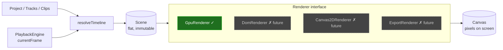

**Hard isolation rules** (every implementation must respect):

- Reads only the `Scene` it receives.
- `render(scene)` is **synchronous** and **idempotent on equal references**.
- `resize` mutates the canvas backing-store; `Scene.stage` is the logical
  coordinate space.

---

## 2. The `Renderer` interface

Four methods. Nothing else is public.

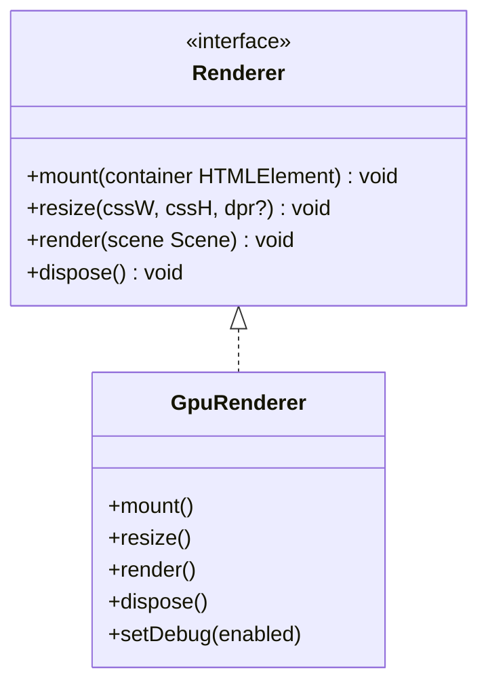

Lifecycle, in order:

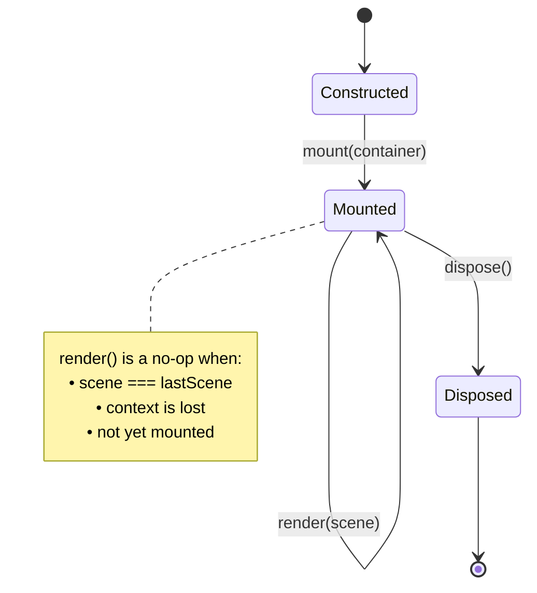

---

## 3. GPU renderer — module map

Everything under `gpu/` collaborates around one idea: turn a `Scene` into a
sorted list of textured-quad draw calls, using GPU memory that is pooled and
async work that never blocks the render path.

```mermaid
flowchart TB
    subgraph public[Public surface]
        GR[GpuRenderer]
    end

    subgraph core[Core pipeline]
        RG[RenderGraph]
        WGL[WebGLContext]
        TP[TexturePool]
        SP[ShaderProgram]
        SH[shaders/<br/>quad.vert + quad.frag]
    end

    subgraph layers[Layers]
        VL[VideoLayer]
        TL[TestLayer]
    end

    subgraph frames[Frame pipeline]
        VFP[VideoFrameProvider<br/>Mock | Synthetic | DecoderBacked]
        VT[VideoTexture]
        FC[FrameCache]
        VDM[VideoDecoderManager]
        DMX[MediabunnyDemuxer]
        DBP[DecoderBackedVideoFrameProvider]
    end

    subgraph dbg[debug/]
        Panel[GpuRendererDebugPanel]
        DGR[DebugGpuRenderer]
        Over[DebugOverlay]
        Cnt[GpuDebugCounters]
        PG[playground.ts]
    end

    GR --> WGL
    GR --> TP
    GR --> RG
    GR --> VL
    GR --> Panel

    RG --> VL
    RG --> TL

    VL --> VFP
    VL --> VT
    VL --> SP
    SP --> SH

    VT --> TP

    VFP --> FC
    VFP -->|demuxerFactory provided| DBP
    DBP --> VDM
    VDM --> DMX
    VDM --> FC

    Panel --> Cnt
    VFP --> Cnt
    VT --> Cnt
```

> **Phase 1 wired** (2026-05-23): `createVideoFrameProvider(src, deps)` returns
> `DecoderBackedVideoFrameProvider` when `deps.demuxerFactory` is provided.
> `SyntheticVideoFrameProvider` (browser dev) and `MockVideoFrameProvider` (jsdom)
> remain for environments without a real demuxer.

---

## 4. `GpuRenderer` — construction & disposal order

Order is load-bearing. Disposing the pool before the graph would leak
acquired textures.

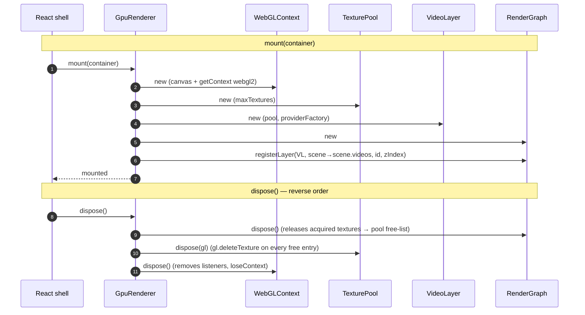

---

## 5. The render tick

Called once per RAF tick by the React shell. Synchronous from top to bottom.
Async decode/upload happens out-of-band on **subsequent** ticks.

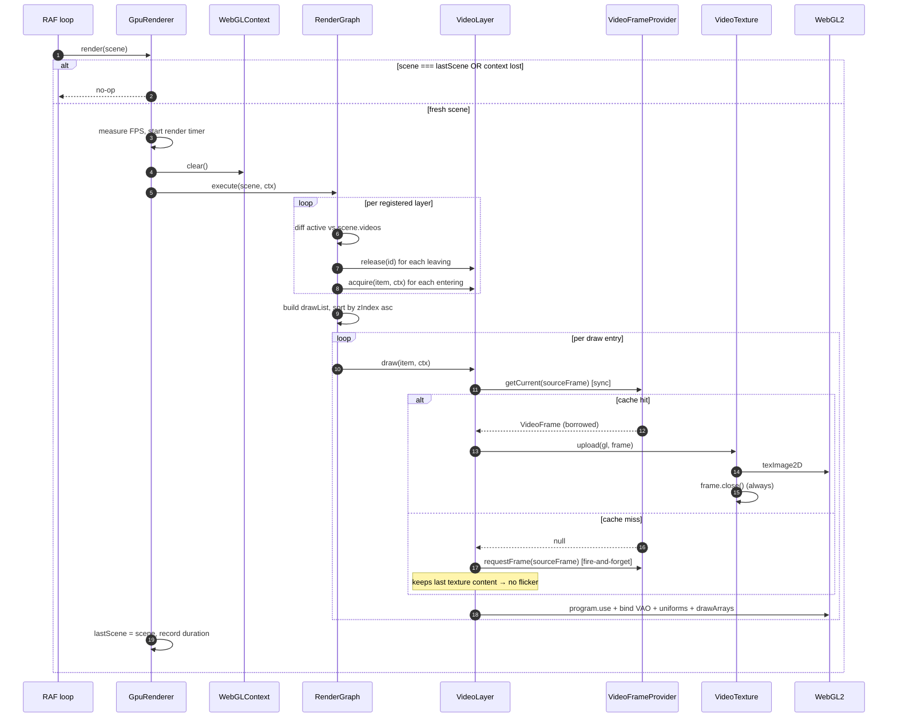

Key invariants this enforces:

- `render()` never awaits.
- `render()` never throws on a missed frame — it draws the last upload.
- Frame ownership: every frame passed to `upload()` is closed exactly once.

---

## 6. Async frame pipeline (out-of-band)

The provider is the boundary between the synchronous render thread and the
asynchronous decode/generation work. Everything below the dashed line happens
on its own schedule and reports back via the cache.

```mermaid
flowchart LR
    subgraph sync [Synchronous — inside render tick]
        VL[VideoLayer.draw]
        VL -- getCurrent(N) --> VFP
        VFP -- frame or null --> VL
    end

    VFP[(VideoFrameProvider)]
    FC[(FrameCache<br/>LRU, owns frames)]
    VFP --- FC

    subgraph async [Asynchronous — setTimeout / future decoder]
        REQ[requestFrame N]
        SYN[Synthetic: paint to OffscreenCanvas<br/>→ new VideoFrame]
        REAL[Future: VideoDecoderManager<br/>→ VideoDecoder.output]
    end

    VFP -- requestFrame(N) --> REQ
    REQ --> SYN
    REQ -. future .-> REAL
    SYN -- put(N, frame) --> FC
    REAL -. put(N, frame) .-> FC

    classDef future stroke-dasharray:4 3,color:#aaa
    class REAL future

    style sync fill:#143,stroke:#3a3
    style async fill:#332,stroke:#b80
```

Cache rules (see [`FrameCache.ts`](./gpu/FrameCache.ts)):

- `put` transfers ownership to the cache.
- `get` returns a **borrowed** reference — callers must not close it.
- When full, the entry with the **lowest** `sourceFrame` is evicted and closed.
- `VideoTexture.upload` is the only consumer that closes a borrowed frame —
  and only in a `finally` block, so the rule still holds end-to-end.

### 6.1 Decode pipeline (Phase 1 — wired)

Full sequence from render tick miss to frame available on the next tick:

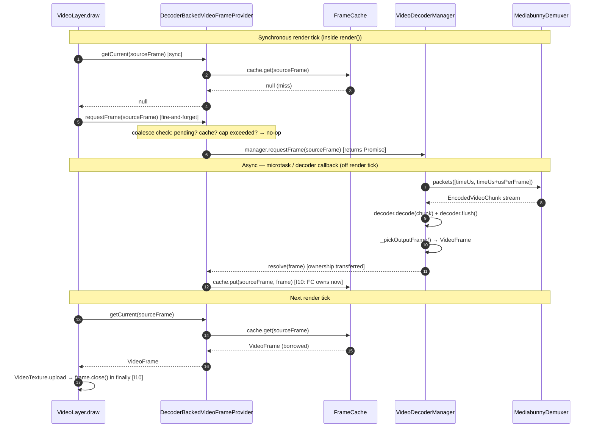

### 6.2 Blob-resolve step (Phase 1 Real Playback)

`createMediabunnyBackend` bridges the `DemuxerBackend.open(src: string)` API to
mediabunny's blob-based `Input + BlobSource`:

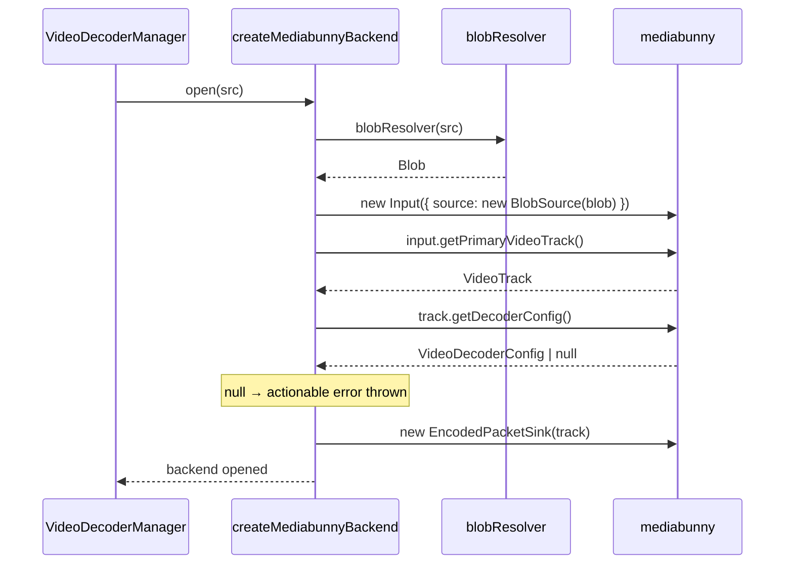

Default `blobResolver` is `fetch(src).blob()`. Override it in the playground
factory (`createPlaygroundDemuxerFactory`) to skip the fetch round-trip for
freshly-imported local files by passing the `File` object directly.

### 6.3 Playback lifecycle (import → pixels)

End-to-end flow from file import to rendered pixels:

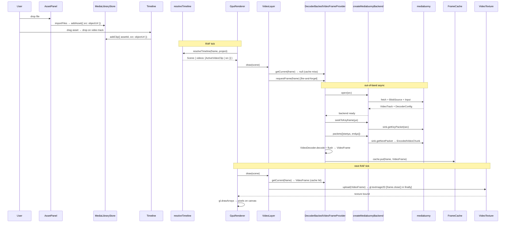

### 6.4 Outstanding decode coalescing

`DecoderBackedVideoFrameProvider` enforces three coalescing rules in `requestFrame()`:

| Rule | Condition | Action |
|---|---|---|
| Cache hit | `cache.has(n)` | No-op |
| In-flight | `_pending.has(n)` | No-op — existing promise will resolve |
| Cap exceeded | `_pending.size >= maxOutstanding` | No-op — back-pressure |

`maxOutstanding` defaults to 4, configurable via `RendererOptions.maxOutstandingDecodes`.

---

## 7. `VideoLayer` — provider & texture bookkeeping

`VideoLayer` is the only place that knows clips share decoders. Providers are
keyed by `src` and ref-counted across clips; textures are keyed by clip `id`.

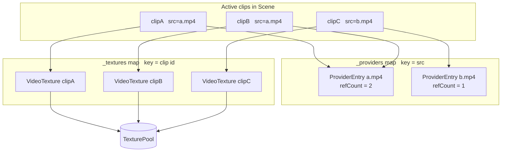

- `acquire(item)` → new `VideoTexture`, bump or create the provider entry.
- `release(id)`   → dispose the texture, decrement refCount, `markIdle()` at 0.
- `draw(item)`    → see render-tick diagram above.

---

## 8. `VideoDecoderManager` state machine

Not yet wired into the live render path, but fully implemented and tested.
One instance per unique source URL. Holds **no** GL objects, so it is immune
to context loss.

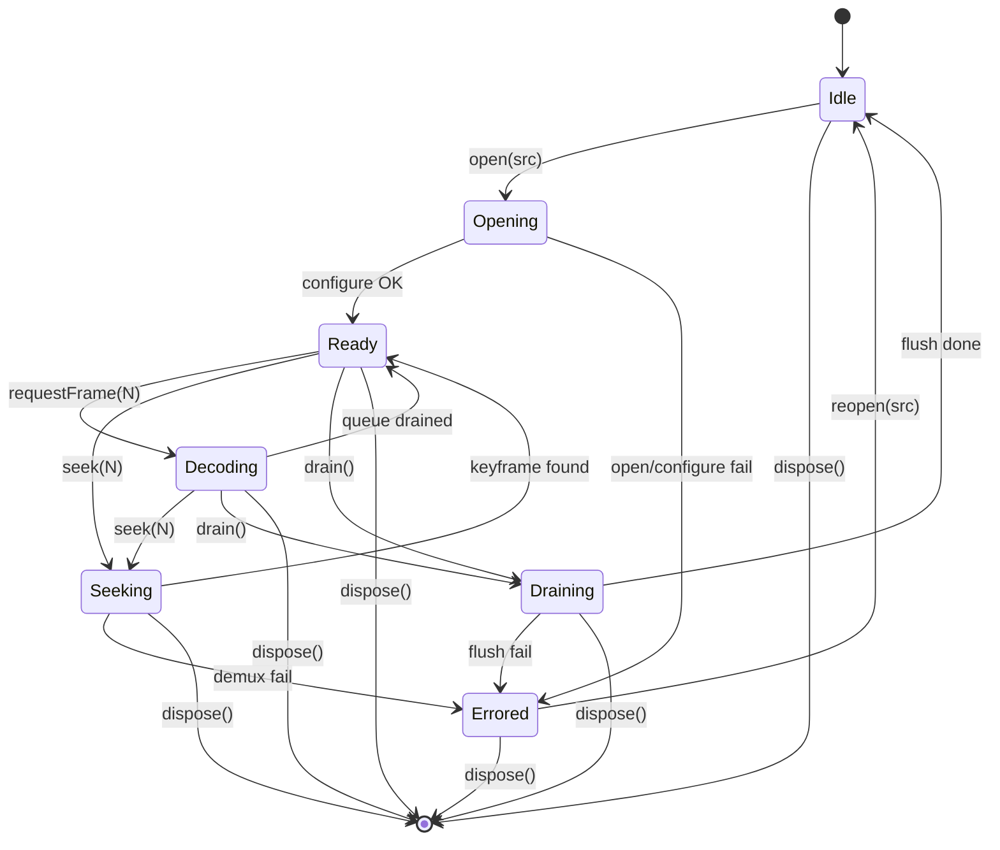

Behavioural guarantees enforced by `_assertTransition`:

- Duplicate `requestFrame(N)` calls coalesce into one decode (the second
  awaits the first's promise).
- `seek()` rejects every pending decode with a `seek cancelled` error.
- `drain()` rejects every pending decode with a `drain cancelled` error.

---

## 9. Context loss & recovery

Browser GPU context loss can happen at any time (tab backgrounded, driver
reset, alt-tab). The renderer survives it because no module silently assumes
its GL handles are still valid.

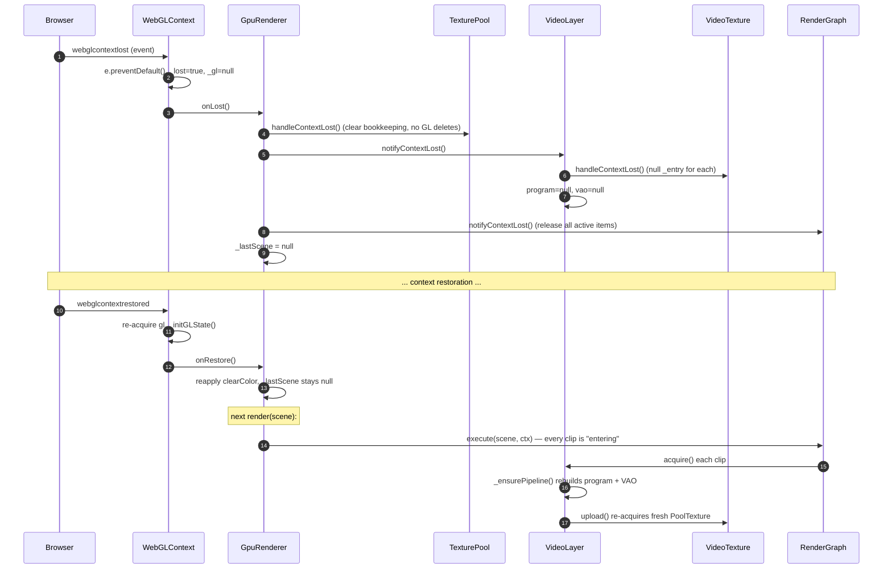

| Module                | Holds GL? | Recovery strategy                                 |
|-----------------------|:--------:|---------------------------------------------------|
| `WebGLContext`        | yes (the context itself) | re-`getContext` on restore, re-run `_initGLState` |
| `TexturePool`         | yes      | `handleContextLost()` clears handles, no deletes  |
| `VideoTexture`        | yes      | `handleContextLost()` nulls `_entry`; re-acquires on next upload |
| `VideoLayer`          | yes (program + VAO) | nulls them; `_ensurePipeline()` rebuilds         |
| `RenderGraph`         | no       | releases all active items; next tick re-acquires  |
| `FrameCache`          | no       | unchanged                                          |
| `VideoDecoderManager` | no       | unchanged                                          |

---

## 10. Frame ownership — single rule, end-to-end

This is the one rule that, if violated, leaks GPU memory.

```mermaid
flowchart LR
    A[Source: Synthetic paint<br/>or VideoDecoder.output] -->|new VideoFrame| FC
    FC[FrameCache<br/>OWNS frames] -->|borrow via get| VL[VideoLayer.draw]
    VL -->|hand off to| VT[VideoTexture.upload]
    VT -->|finally close| X((frame.close))

    FC -.LRU evict.-> X
    FC -.dispose / clear.-> X

    classDef owner fill:#143,stroke:#3a3
    class FC owner
```

Every arrow into `X` happens **exactly once per frame**, and they are mutually
exclusive: the cache stops owning a frame the moment it is given to
`VideoTexture.upload`, and the upload always closes it in `finally`.

---

## 11. Debug pipeline (optional)

Imported only when needed. Zero impact on production rendering.

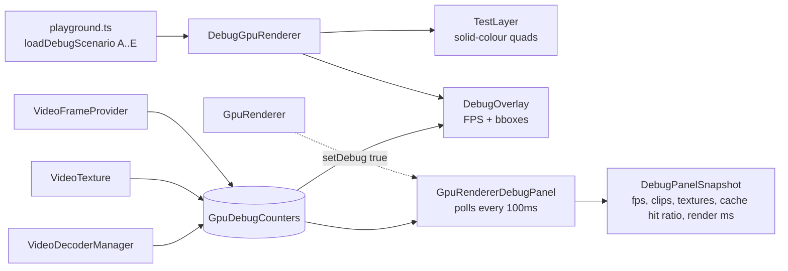

The debug renderer is a **parallel** implementation that shares only
`WebGLContext`, `TexturePool`, and `RenderGraph` — it exists to exercise the
shader / transform / zIndex paths without any decode plumbing.

---

## 12. What is done vs. what is next

```mermaid
graph LR
    subgraph done[Done — usable today]
        D1[Renderer interface]
        D2[WebGLContext + context-loss recovery]
        D3[TexturePool LRU 16-cap]
        D4[ShaderProgram + quad shaders]
        D5[RenderGraph diff/acquire/release/zSort]
        D6[VideoLayer Scene→draw with transform/opacity]
        D7[VideoTexture frame-ownership invariant]
        D8[FrameCache LRU + onPut/onEvict hooks]
        D9[VideoFrameProvider Mock + Synthetic]
        D10[VideoDecoderManager state machine + tests]
        D11[MediabunnyDemuxer adapter shape]
        D12[Debug overlay + scenarios A..E]
        D13[18 vitest suites green]
    end

    subgraph next[Next]
        N3[DomRenderer for cheap MVP]
        N4[ExportRenderer Worker + VideoEncoder]
        N5[Wire setDebug into apps/playground/GpuPreview]
        N6[AudioScheduler Phase 2]
        N7[TextLayer Phase 3]
    end

    done --> next

    subgraph phase1[Phase 1 — wired 2026-05-23]
        P1[DecoderBackedVideoFrameProvider]
        P2[createVideoFrameProvider demuxerFactory path]
        P3[fps parameterization in VideoDecoderManager]
        P4[droppedFrames + outstandingDecodes in GpuDebugCounters]
        P5[createMediabunnyBackend adapter + actionable error]
        P6[RecordingGl golden-frame test harness]
    end

    classDef done fill:#1f6f1f,stroke:#0a0,color:#fff
    classDef phase1 fill:#1a4a6f,stroke:#07f,color:#fff
    classDef next fill:#444,stroke:#888,color:#ccc,stroke-dasharray:4 3
    class D1,D2,D3,D4,D5,D6,D7,D8,D9,D10,D11,D12,D13 done
    class P1,P2,P3,P4,P5,P6 phase1
    class N3,N4,N5,N6,N7 next
```

---

## File index (quick jump)

| Concern                   | File                                                                 |
|---------------------------|----------------------------------------------------------------------|
| Public interface          | [`types.ts`](./types.ts)                                             |
| GPU entry point           | [`gpu/GpuRenderer.ts`](./gpu/GpuRenderer.ts)                         |
| Scene diff / dispatch     | [`gpu/RenderGraph.ts`](./gpu/RenderGraph.ts)                         |
| GL context + recovery     | [`gpu/WebGLContext.ts`](./gpu/WebGLContext.ts)                       |
| Texture allocator         | [`gpu/TexturePool.ts`](./gpu/TexturePool.ts)                         |
| Shader helper             | [`gpu/ShaderProgram.ts`](./gpu/ShaderProgram.ts) + [`gpu/shaders/`](./gpu/shaders) |
| Video layer               | [`gpu/layers/VideoLayer.ts`](./gpu/layers/VideoLayer.ts)             |
| Per-clip GPU texture      | [`gpu/VideoTexture.ts`](./gpu/VideoTexture.ts)                       |
| Frame access boundary     | [`gpu/VideoFrameProvider.ts`](./gpu/VideoFrameProvider.ts)           |
| Decoded-frame cache       | [`gpu/FrameCache.ts`](./gpu/FrameCache.ts)                           |
| Decoder + state machine   | [`gpu/VideoDecoderManager.ts`](./gpu/VideoDecoderManager.ts)         |
| Demuxer adapter           | [`gpu/demuxer/MediabunnyDemuxer.ts`](./gpu/demuxer/MediabunnyDemuxer.ts) |
| mediabunny backend adapter | [`gpu/demuxer/createMediabunnyBackend.ts`](./gpu/demuxer/createMediabunnyBackend.ts) |
| Real decode provider      | [`gpu/DecoderBackedVideoFrameProvider.ts`](./gpu/DecoderBackedVideoFrameProvider.ts) |
| Debug renderer & overlay  | [`gpu/debug/`](./gpu/debug)                                          |
| Recording GL (test only)  | [`gpu/debug/RecordingGl.ts`](./gpu/debug/RecordingGl.ts)            |
| Tests (23+ suites)        | [`gpu/__tests__/`](./gpu/__tests__)                                  |
